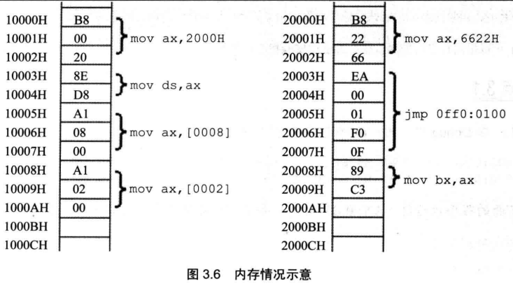
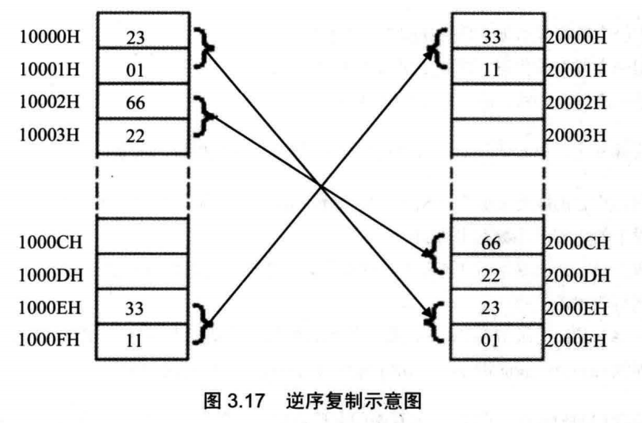
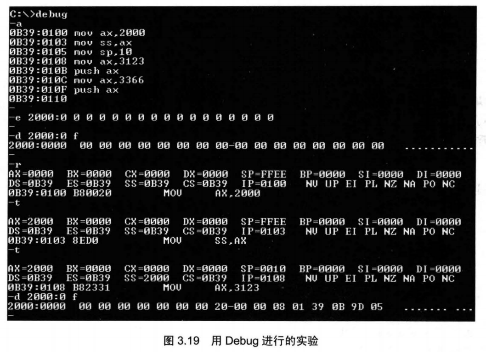

# 第 3 章：寄存器（内存访问）

## 检测点 3.1

（1）在 Debug 中，用 “**d 0:0 1f**” 查看内存，结果如下。

```text
0000:0000 70 80 F0 30 EF 60 30 E2-00 80 80 12 66 20 22 60
0000:0010 62 26 E6 D6 CC 2E 3C 3B-AB BA 00 00 26 06 66 88
OFFSET     0  1  2  3  4  5  6  7  8  9  A  B  C  D  E  F 
```

下面的程序执行前，AX = 0，BX = 0，写出每条汇编指令执行完后相关寄存器中的值。

| 指令 | 寄存器 |
| :--- | :--- |
| mov ax, 1 |  |
| mov ds, ax | **\(DS = 0001\)** |
| mov ax, \[0000\] | AX = &lt;0001:0000&gt; = &lt;0010&gt; **2662** |
| mov bx, \[0001\] | BX = &lt;0011&gt; = **E626** |
| mov ax, bx | AX = **E626** |
| mov ax, \[0000\] | AX = **2662** |
| mov bx, \[0002\] | BX = &lt;0012&gt; = **D6E6** |
| add ax, bx | AX = **FD48** |
| add ax, \[0004\] | AX = 2ECC + FD48 =  **2C14** |
| mov ax, 0 | AX = **0000** |
| mov al, \[0002\] | AX = **00E6** |
| mov bx, 0 | BX = **0000** |
| mov bl, \[000C\] | BX = **0026** |
| add al, bl | AX = **000C** |

提示 ， 注意 ds 的设置 。

（2）内存中的情况如图 3.6 所示。



各寄存器的初始值：CS=2000H，IP=0，DS=1000H， AX=0，BX=0； 

① 写出 CPU 执行的指令序列（用汇编指令写出）。

② 写出 CPU 执行每条指令**后**，CS、IP 和相关寄存器中的数值。

③ 再次体会：数据和程序有区别吗？如何确定内存中的信息哪些是数据，哪些是程序？

**答案：**

① 

```c
mov ax, 6622
jmp 0ff0:0100   (->0ff00+00100=ff100=10000)
mov ax, 2000
mov ds, ax      (ds=2000)
mov ax, [0008]  (ax=20008)
mov ax, [0002]  (ax=20002)
```

②

| 指令 | CS | IP | CS+IP | AX | BX | DS |
| :--- | :---: | :---: | :---: | :---: | :---: | :---: |
| mov ax, 6622 | 2000 | 0003 | 20003 | 6622 | 0000 | 1000 |
| jmp 0ff0:0100 | 0FF0 | 0100 | 10000 | ↑ | ↑ | ↑ |
| mov ax, 2000 | ↑ | 0103 | 10003 | 2000 | ↑ | ↑ |
| mov ds, ax | ↑ | 0105 | 10005 | ↑ | ↑ | 2000 |
| mov ax, \[0008\] | ↑ | 0108 | 10008 | C389 | ↑ | ↑ |
| mov ax, \[0002\] | ↑ | 010B | 1000B | EA66 | ↑ | ↑ |

## 检测点 3.2

（1）补全下面的程序，使其可以将 10000H~1000FH 中的 8 个字，逆序复制到 20000H~2000FH 中 。逆序复制的含义如图 3.17 所示（图中内存里的数据均为假设） 。



| 指令 |
| :--- |
| mov ax, 1000H |
| mov ds, ax |
| **mov ax, 2000H** |
| **mov ds, ax** |
| **mov sp, 0010H** |
| push \[0\] |
| push \[2\] |
| push \[4\] |
| push \[6\] |
| push \[8\] |
| push \[A\] |
| push \[C\] |
| push \[E\] |

（2）补全下面的程序，使其可以将 10000H~1000FH 中的 8 个宇，逆序复制到 20000H~2000FH 中 。

| 指令 |
| :--- |
| mov ax, 2000H |
| mov ds, ax |
| **mov ax, 1000H** |
| **mov ds, ax** |
| **mov sp, 0000H** |
| pop \[E\] |
| pop \[C\] |
| pop \[A\] |
| pop \[8\] |
| pop \[6\] |
| pop \[4\] |
| pop \[2\] |
| pop \[O\] |

## 实验二（略）

（1）使用 Debug，将下面的程序段写入内存，逐条执行，根据指令执行后的实际运行情况填空。

| 指令 | 值 | 说明 |
| :--- | :--- | :--- |
| mov ax, ffff |  |  |
| mov ds, ax |  |  |
|  |  |  |
| mov ax, 2200 |  |  |
| mov ss, ax |  |  |
|  |  |  |
| mov sp, 0100 |  |  |
|  |  |  |
| mov ax, \[0\] | ; ax= |  |
| add ax, \[2\] | ; ax= |  |
| mov bx, \[4\] | ; bx= |  |
| add bx, \[6\] | ; bx= |  |
|  |  |  |
| push ax | ; sp= | ; 修改的内存单元的地址是：**2200:**，内容为： |
| push bx | ; sp= | ; 修改的内存单元的地址是：**2200:**，内容为： |
| pop ax | ; sp= | ; ax= |
| pop bx | ; sp= | ; bx= |
|  |  |  |
| push \[4\] | ; sp= | ; 修改的内存单元的地址是：，内容为 |
| push \[6\] | ; sp= | ; 修改的内存单元的地址是：，内容为 |

（2）仔细观察图 3.19 中的实验过程，然后分析：为什么 2000:0~2000:f 中的内容会发生改变？ 



可能要再做些实验才能发现其中的规律。如果你在这里就正确回答了这个问题，那么要恭喜你，因为你有很好的悟性。大多数的学习者对这个问题还是比较迷惑的，不过不要紧，因为随着课程的进行，这个问题的答案将逐渐变得显而易见。

