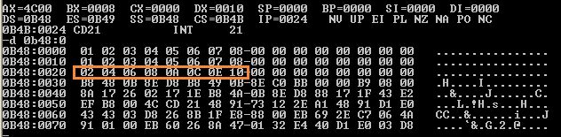
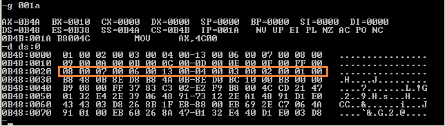

# 第 6 章：包含多个段的程序

## 检测点 6.1

（1）下面的程序实现依次用内存 0:0~0:15 单元中的内容改写程序中的数据 ， 完成程序：

```text
assume cs:codesg
codesg segment

        dw  0123h,0456h,0789h,0abch,0defh,0fedh,0cbah,0987h

start:  mov ax,0
        mov ds,ax
        mov bx,0

        mov cx,8
    s:  mov ax,[bx]
        mov cs:[bx],ax  ; Add codes here
        add bx,2
        loop s
        
        mov ax,4c00h
        int 21h

codesg ends
end start
```

（2）下面的程序实现依次用内存 0:0~0:15 单元中的内容改写程序中的数据，数据的传送用栈来进行。栈空间设置在程序内。完成程序：

```text
assume cs:codesg
codesg segment
        
        dw 0123h,0456h,0789h,0abch,0defh,0fedh,0cbah,s0987h
        dw 0,0,0,0,0,0,0,0,0,0

start:  mov ax,cs       ; stack segment address should be 
                        ;   the same with cs, because the space of stack
                        ;   is allocated in code segments
        mov ss,ax
        mov sp,24h      ; Initial address of stack bottom,
                        ;   09h(16 dw) + 14h(10 dw 0) + 1 = 24h
        mov ax,0
        mov ds,ax
        mov bx,0
        mov cx,8

    s:  push [bx]       ; push ds:[bx] to stack top
        pop ss:[bx]     ; pop stack top to memory cs:[bx]
        add bx,2
        loop s
        
        mov ax,4c00h
        int 21h
    
codesg ends
end start
```

### 参考链接

* 汇编语言（王爽第三版）检测点6.1 - 筑基2017 - 博客园 
  * [https://www.cnblogs.com/Base-Of-Practice/articles/6883898.html](https://www.cnblogs.com/Base-Of-Practice/articles/6883898.html)

## 实验 5：编写、调试具有多个段的程序

（1）将下面的程序编译 、连接，用 Debug 加载、跟踪，然后回答问题。

```text
assume cs:code, ds:data, ss:stack

data segment
    dw 0123h,0456h,0789h,0abch,0defh,0fedh,0cbah,0987h
data ends

stack segment
    dw 0,0,0,0,0,0,0,0
stack ends

code segment
start:  mov ax,stack
        mov ss,ax
        mov sp,16      ; stack bottom
        mov ax,data
        mov ds,ax
        push ds:[0]
        push ds:[2]
        pop ds:[2]
        pop ds:[0]
        
        mov ax,4c00h
        int 21h
code ends

end start
```

① CPU 执行程序，程序返回前，data 段中的数据为多少？

答案：程序返回前，**data 段的数据未发生变化**，为：

```text
-d 0b48:0 f
0B48:0000 23 01 56 04 89 07 BC 0A-EF 0D ED 0F BA 0C 87 09
```

② CPU 执行程序，程序返回前，cs=\_\_\_\_、ss=\_\_\_\_、ds=\_\_\_\_。

答案：程序返回前，cs = **0B4A**、ss=**0B49**、ds=**0B48**。（总之递减 1）

③ 设程序加载后，code 段的段地址为 X，则 data 段的段地址为\_\_\_\_，stack 段的段地址为\_\_\_\_。

答案：code 段地址为 X，data 段地址为 **X-2**，stack 段地址为 **X-1**。


（2）将下面的程序编译、连接，用 Debug 加载、跟踪，然后回答问题。

```text
assume cs:code, ds:data, ss:stack

data segment
    dw 0123H,0456H
data ends

stack segment
    dw 0,0
stack ends

code segment
start : mov ax,stack
        mov ss,ax
        mov sp,16
        mov ax,data
        mov ds,ax
        push ds:[0]
        push ds:[2]
        pop ds:[2]
        pop ds:[0]

        mov ax,4c00h
        int 21h
code ends

end start
```

① CPU 执行程序，程序返回前，data 段中的数据为多少？

答案：虽然我们在 data 段和 stack 段中只定义初始化了4个字节的内存，但在汇编中，会直接分配 16 个字节的空间，不足的用 00 补全。故 data 段中数据为：

```text
-d 0b48:0 f
0B48:0000 23 01 56 04 00 00 00 00 00-00 00 00 00 00 00 00 00
```

② CPU 执行程序，程序返回前，cs=\_\_\_\_、ss=\_\_\_\_、ds=\_\_\_\_。

答案：程序返回前，cs = **0B4A**、ss=**0B49**、ds=**0B48**。（总之递减 1）

③ 设程序加载后，code 段的段地址为 X，则 data 段的段地址为\_\_\_\_，stack 段的段地址为\_\_\_\_。

答案：code 段地址为 X，data 段地址为 **X-2**，stack 段地址为 **X-1**。

④ 对于如下定义的段：

```text
name segment
...
name ends
```

如果段中的数据占 N 个字节，则程序加载后，该段实际占有的空间为\_\_\_\_。

答案： $$(\lfloor\frac{N}{16}\rfloor + 1) * 16$$ （字节）。


（3）将下面的程序编译、连接，用 Debug 加载、跟踪，然后回答问题。

```text
assume cs:code, ds:data, ss:stack

code segment
start: mov ax,stack
        mov ss,ax
        mov sp,16
        mov ax,data
        mov ds,ax
        push ds: [0]
        push ds: [2]
        pop ds: [2]
        pop ds: [0]
        
        mov ax,4c00h
        int 21h
code ends

data segment
    dw 0123H,0456H
data ends

stack segment
    dw 0,0
stack ends

end start
```

① CPU 执行程序，程序返回前，data 段中的数据为多少？

答案：同（2）①：

```text
-d 0b48:0 f
0B48:0000 23 01 56 04 00 00 00 00 00-00 00 00 00 00 00 00 00
```

② CPU 执行程序，程序返回前，cs=\_\_\_\_、ss=\_\_\_\_、ds=\_\_\_\_。

答案：这次将 data 和 stack 段放到了 code 段后面，因此需要注意它们段地址的变化。

程序返回前，cs = **0B48**、ss=**0B4C**、ds=**0B4B**。（总之递减 1）

③ 设程序加载后，code 段的段地址为 X，则 data 段的段地址为\_\_\_\_，stack 段的段地址为\_\_\_\_。

答案：code 段地址为 X，data 段地址为 **X+3**，stack 段地址为 **X+4**。

那么，为什么 stack 和 data 的段地址和 code 的相差是这个数？

看 cx 的值，程序加载时，我们发现 cx=0044h，其含义是：此程序所有机器码占用的空间是44h=68 字节。由于定义的 data 和 stack 都小于 16 个字节，一律按照 16 个字节分配空间，其余补 00；剩余的 68-32=36 个字节就是 code 段真正的可执行的机器码。code 段的真实大小为 \(36/16+1\)\*16 = 48 字节，因此 data 的地址为 X+3。另外，code 段剩下的字节补 00。


（4）如果将 \(1\) 、 \(2\) 、 \(3\) 题中的最后一条伪指令 “end start” 改为 “end”（也就是说，不指明程序的入口），则哪个程序仍然可以正确执行？请说明原因。

答案：都能正常运行，但只有（3）的程序可以正确执行。因为只有它的可执行代码在内存中是在最前面。

如果不指明程序入口，程序会从加载进内存的第一个单元起开始执行，前 2 题中，定义的是数据，而 CPU仍会将数据当做指令代码执行。只不过程序执行时逻辑上是错误了。

如果指明了程序入口，CPU 会直接从入口处开始执行真正的机器码，直到遇到中断指令返回。此种方式能够确保程序逻辑上的正确。因此有必要为程序指明入口。


（5）程序如下，编写 code 段中的代码，将 a 段和 b 段中的数据依次相加，将结果存到 c 段中。

1、这个题目一下子搞出 3 个数据段了。呵呵，貌似我们段寄存器不够用了。cs（代码段），ss（栈段），这二个千万别碰！那只有 ds 和 es 了。思路：将 a 和 b 段我们用一个段地址表示，存储在 ds 中；c 段我们存储在 es 中。这种方式好吗？不太好。

2、上面已经体会了，当一个数据段不足 16 个字节时，按 16 个字节分配内存空间，其余的补 0。我们发现 a、b 段都是定义了 8 个字节的数值。并且是相邻的（肯定是的），那么 a 段的地址我们使用 \[bx+idata\] 表示，b 段我们也使用 \[bx+idata\] 表示。这种方式没有把 a 段和 b 段分开。

3、最终决定：将 es 指向 c 段，ds 分开分别的指向 a 段和 b 段，这样我们在一个循环内完成所有的工作了；程序中使用了栈保存了 ds 的值；

```text
assume cs:code

a segment
    db 1,2,3,4,5,6,7,8
a ends

b segment
    db 1,2,3,4,5,6,7,8
b ends

cz segment     ; use cz, since masm does not permit 'c'
    db 0,0,0,0,0,0,0,0
cz ends

code segment
start:
    mov ax,a
    mov ds,ax  ; ds points to seg a
    mov ax,b
    mov es,ax  ; es points to seg b

    mov bx,0   ; bx is a counter of offset
    mov cx,8   ; loop count

s:
    mov dl,ds:[bx]
    add dl,es:[bx]
    push ds     ; save original ds content of seg a
    mov ax,cz
    mov ds,ax   ; ds points to seg c

    mov ds:[bx],dl  ; write byte add result to seg c

    pop ds      ; restore ds content of seg a

    inc bx
    loop s

    mov ax,4c00h
    int 21h
code ends

end start
```



结果分析：

1、ds 段寄存器在程序中可以存储不同的内存段的段地址，并不是唯一存储一个段地址，es 也是如此。

2、合理利用系统自动创建的栈空间，利用栈空间来保存暂存的数据。注意压栈和弹栈的顺序，确保操作的是一个数据对象。

3、在遇到多个数据段的情况下，这种方式可以利用一个段寄存器来对多个内存段寻址。

4、在实际工程中，在程序中保存的数据，都是程序的一些必须的初始化的数据，其他的数据都应保存在磁盘文件中，需要时才读入内存中。此例中的 a、b、cz 段都是其他的数据，在这里就是演示。


**如果难理解，可以在纸上把段和寄存器都列出来，画一画数据的流程图，会发现并不难。**


（6）程序如下，编写 code 段中的代码，用 push 指令将 a 段中的前 8 个字型数据，逆序存储到 b 段中。

1、理解掌握栈的原理，先进后出，从高地址向低地址发展。也就是说先压栈的数据在栈底，最后被 pop 出。

2、对于数据段，我们定义 2 个，ds 指向 a 段，ss 指向 b。ss 指向了 b 段，也就意味着 b 段是人工创建的一个栈结构了。

3、对于 push 和 pop 指令：操作的是一个栈帧或栈单元，它的操作数是一个字，在 8086CPU 中是一个字，2 个字节，这个在 a、b 段定义时我们应该发现，它们都是定义的字。如果定义的是 db 字节呢？一样的。

```text
assume cs:code

a segment
    dw 1,2,3,4,S,6,7,8,9,0ah,0bh,0ch,0dh,0eh,0fh,0ffh
a ends

b segment
    dw 0,0,0,0,0,0,0,0
b ends

code segment
start:
    mov ax,a
    mov ds,ax   ; ds points to a
    mov ax,b
    mov ss,ax   ; ss points to b
    mov sp,16   ; sp points to empty stack top

    mov bx,0
    mov cx,8    ; loop 8 times, push first 8 bytes of seg a to seg b
s:  
    push ds:[bx]    ; push byte in seg a to seg b
    add bx,2
    loop s

    mov ax,4c00h
    int 21h

code ends

end start
```



### 参考链接

* 汇编语言（王爽第三版）实验5 编写、调试具体多个段的程序 - 筑基2017 - 博客园 
  * [https://www.cnblogs.com/Base-Of-Practice/articles/6883894.html](https://www.cnblogs.com/Base-Of-Practice/articles/6883894.html)


