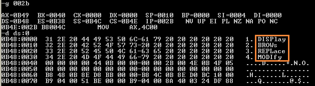

# 第 7 章：更灵活的定位内存地址的方法

## 实验6

问题 7.9：编程，将 datasg 段中每个单词的前 4 个字母改为大写字母。

```text
assume cs:code, ss:stack, ds:data

data segment
    db '1. display      '
    db '2. brows        '
    db '3. replace      '
    db '4. modify       '
data ends

stack segment
    dw 16 dup (0)
stack ends

code segment
start:
    mov ax,data
    mov ds,ax       ; ds points to data seg

    mov bx,0

    mov ax,stack
    mov ss,ax
    mov sp,16       ; sp points to stack top

    mov cx,4        ; outer loop 4 rows
    
sout:
    push cx         ; push cx (outer loop counter) to stack
    mov si,0        ; offset of each char

    mov cx,4        ; inner loop 4 cols
sin:
    mov al,[bx+si+3]    ; first char of string is at pos 3
    and al,11011111b    ; upper char
    mov [bx+si+3],al    ; overwrite ds
    inc si
    loop sin

    add bx,16       ; next string
    pop cx          ; restore cx (outer loop counter)
    loop sout

    mov ax,4c00h
    int 21h

code ends

end start
```



### 参考链接

* 汇编语言（王爽第三版）实验6 实践课程中的程序 - 筑基2017 - 博客园 
  * [https://www.cnblogs.com/Base-Of-Practice/articles/6883902.html](https://www.cnblogs.com/Base-Of-Practice/articles/6883902.html)

