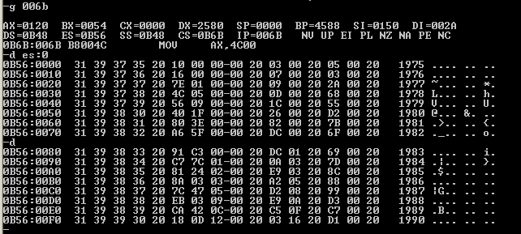

# 第 8 章：数据处理的两个基本问题

## 实验 7 寻址方式在结构化数据访问中的应用

提示，可将 **data** 段中的数据看成是多个数组，而将 **table** 中的数据看成是一个结构型数据的数组，每个结构型数据中包含多个数据项。可用 **bx** 定位每个结构型数据，用 **idata** 定位数据项，用 **si** 定位数组项中的每个元素，对于 **table** 中的数据的访问可采用 **\[bx\].idata** 和 **\[bx\].idata\[si\]** 的寻址方式。

注意，这个程序是到目前为止最复杂的程序，它几乎用到了我们以前学过的所有知识和编程技巧。所以，这个程序是对我们从前学习的最好的实践总结。请认真完成。

```text
assume ds:data, es:table, cs:code

data segment
    db '1975','1976','1977','1978','1979','1980','1981','1982','1983'
    db '1984','1985','1986','1987','1988','1989','1990','1991','1992'
    db '1993','1994','1995'
    ; 以上是表示 21 年的 21 个字符串

    dd 16,22,382,1356,2390,8000,16000,24486,50065,97479,140417,197514
    dd 345980,590827,803530,1183000,1843000,2759000,3753000,4649000,5937000
    ; 以上是表示 21 年公司总收入的 21 个 dword 型数据
    
    dw 3,7,9,13,28,38,130,220,476,778,1001,1442,2258,2793,4037,5635,8226
    dw 11542,14430,15257,17800
    ; 以上是表示 21 年公司雇员人数的 21 个 word 型数据
data ends

;            年份（4 字节） - 收入（4 字节） -  雇员数（2 字节） - 人均收入（2 字节） -
;  table:0         '1975'            16                3                   ?
;  table:10H       '1976'            22                7                   ?
;  ...
;  table:140H      '1995'        593700            17800                   ?

table segment
    db 21 dup ('year summ ne ?? ') ; 字符串占据 16 个字节
table ends

code segment
start:
    ; 初始化 data 和 table 指向
    mov ax,data
    mov ds,ax       ; ds 指向 data 段
    mov ax,table
    mov es,ax       ; es 指向 table 段

    ; 初始化偏址寄存器
    mov bx,0        ; 将用于年份和总收入的偏址
    mov di,0        ; 将用于雇员数的偏址
    mov si,0        ; 将用于 table 的偏址

    mov cx, 21      ; 共 21 条数据

s:
    ; 写入年份
    mov ax,ds:0[bx]
    mov es:0[si],ax
    mov ax,ds:2[bx]
    mov es:2[si],ax

    mov al,20h
    mov es:4[si],al

    ; 写入总收入
    mov ax,ds:84[bx]    ; 21 x 4 = 84
    mov es:5[si],ax
    mov ax,ds:86[bx]
    mov es:7[si],ax

    mov al,20h
    mov es:9[si],al

    ; 写入雇员数
    mov ax,ds:168[di]   ; 21 * 4 + 21 * 4 = 168
    mov es:10[si],ax

    mov al,20h
    mov es:12[si],al

    ; 人均收入
    mov ax,ds:84[bx]
    mov dx,ds:86[bx]    ; 被除数：总收入
    mov bp,ds:168[di]   ; 除数：雇员数

    div bp              ; 除法结果：商在 ax，余数在 dx

    mov es:13[si],ax

    mov al,20h
    mov es:15[si],al

    ; 递增偏址变量
    add bx,4    ; 年份和总收入
    add di,2    ; 雇员数
    add si,16   ; table 行

    loop s

    mov ax,4c00h
    int 21h

code ends

end start   ; 不要忘了加 start！
```



### 参考链接

* 汇编语言（王爽第三版）实验7 寻址方式在结构化数据访问中的应用 - 筑基2017 - 博客园 
  * [https://www.cnblogs.com/Base-Of-Practice/articles/6883907.html](https://www.cnblogs.com/Base-Of-Practice/articles/6883907.html)

