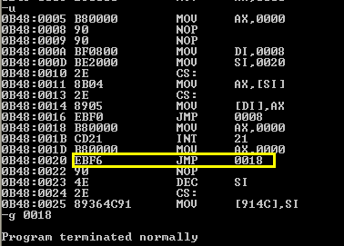
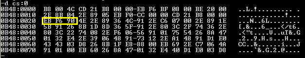
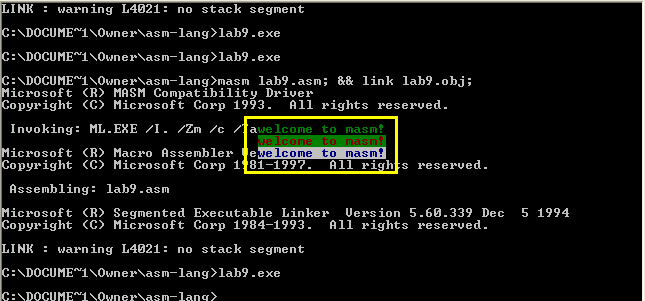

# 第 9 章：转移指令的原理

## 检测点 9.1

（1）程序如下。若要使程序中的 jmp 指令执行后， CS:IP 指向程序的笫一条指令，在 data 段中应该定义哪些数据？

```text
assume cs:code

data segment
    ?
data ends

code segment
start:
    mov ax,data
    mov ds,ax
    mov bx,0
    jmp word ptr [bx+1]
code ends

end start
```

答案：**word ptr \[bx+1\]** 指的是一个字单元，也即 2 个字节，也就是说在 data 段中是第 2~3 字节，如果 jmp 转移到程序第一条指令，也即 IP 的值为 0000 即可。故只需第 2、3 字节均为 0 即可。如下：

```text
data segment
    dw 3 dup (0)
data ends
```

（2）程序如下。补全程序，使 jmp 指令执行后， CS:IP 指向程序的笫一条指令 。

```text
assume cs:code

data segment
    dd 12345678H
data ends

code segment
start:
    mov ax,data
    mov ds,ax
    mov bx,0
    mov [bx],_____
    mov [bx+2],_____
    jmp dword ptr ds:[0]
code ends

end start
```

答案：\[bx\] 代表低 16 位的字，对应 IP；\[bx+2\] 代表了高 16 位的字，即 CS。所以只需要保证 data 段中第 1、2 字节是 IP 的值，第 3、4 字节是 CS 的值即可。

```text
    mov [bx],offset start  ; IP
    mov [bx+2],code        ; CS
```

（3）用 Debug 查看内存，结果如下：

```text
2000:1000    BE 00 06 00 00 00 ...
```

则此时，CPU 执行下述命令后，\(CS\)=?，\(IP\)=?：

```text
mov ax,2000H
mov es,ax
jmp dword ptr es:[1000H]
```

答案：\(CS\)=0006h，\(IP\)=00BEh。

## 检测点 9.2

补全编程，利用 jcxz 指令，实现在内存 2000H 段中查找笫一个值为 0 的字节，找到后，将它的偏移地址存储在 dx 中 。

```text
assume cs:code

code segment
start:
    mov ax,2000H
    mov ds,ax
    mov bx,0
s:
    mov ch,0       ;
    mov cl,[bx]    ;
    jcxz ok        ;
    inc bx         ;
    jmp short s
ok:
    mov dx,bx
    mov ax,4c00h
    int 21h
code ends

end start
```

答案：这里我们需要 jcxz 实现循环的跳出，需要想办法将 cx 的内容赋值为 ds:bx，也就是说从 ds:\[0\] 开始，逐个字节的将单元内容赋值给 cx，然后执行 jcxz 语句。

由于是逐个字节的比较，bx 的偏移量应以字节为单元。我们使用的 cx 寄存器是 16 位的，因此只需要低 8 位的 cl 寄存器就可以了。为了保证 ch 为 0，首先必须置零。它们组合在一起就是 cx 的整体值。

## 检测点 9.3

补全编程，利用 loop 指令，实现在内存 2000H 段中查找笫一个值为 0 的字节，找到后，将它的偏移地址存储在 dx 中。

```text
assume cs:code

code segment
start:
    mov ax,2000H
    mov ds,ax
    mov bx,0
s:
    mov cl,[bx]
    mov ch,0
    inc cx          ;
    inc bx
    loop s
ok:
    dec bx          ; dec 指令的功能和 inc 相反，dec bx 进行的操作为：(bx)=(bx)-1
    mov dx,bx
    mov ax,4c00h
    int 21h
code ends

end start
```

答案：保证这个 loop 循环的动力是：cx!=0，首先搞清这点。其次，理解 loop 指令的动作，首先是 cx=cx-1，然后才是跳转到标号执行。因此，若 cx==0，需要先 +1 才能保证 loop 中判断的是实际的 cx 值。

### 参考链接

* 汇编语言（王爽第三版）检测点:9 - 筑基2017 - 博客园 
  * [https://www.cnblogs.com/Base-Of-Practice/articles/6883918.html](https://www.cnblogs.com/Base-Of-Practice/articles/6883918.html)

## 实验 8

分析下面的程序，在运行前思考：这个程序可以正确返回吗？

 运行后再思考：为什么是这种结果？

 通过这个程序加深对相关内容的理解。

```text
assume cs:codesg

codesg segment
    mov ax,4c00h
    int 21h

start: 
    mov ax , 0
s:  
    nop
    nop
    mov di,offset s
    mov si,offset s2
    mov ax,cs:[si]
    mov cs:[di],ax
s0:
    jmp short s
s1:
    mov ax,0
    int 21h
    mov ax,0
s2:
    jmp short s1
    nop

codesg ends
end start
```

答案：

1、程序入口为有 start 标号的地方。

2、s 标号中语句 nop 会在运行时在代码段分配一个字节的空间。（机器码为 90，在内存中就是90H），其作用是方便在程序运行时代码段分配空间，在此写入代码（实际是机器码）。执行 2 次 nop 后，在 CS 段中分配了 2 个字节空间，内容都是 90H。（这个空间目前是空的，CPU 遇到 这2 个字节，就不执行，顺序执行下面的机器码。）

3、12~15 行这四条语句的作用是将 s2 处的机器码赋值给 s 标号开始的 2 个连续空间中，也就是说，将 **jmp short s1** 这个指令的机器码（2 个字节）赋值给了 s 标号后面的 2 个字节。

 **jmp short s1** 机器码到底是多少？（理解 jmp 指令偏移的是相对位移）它应该是从 si 标号偏移地址到 ****jmp 指令后的第一个字节的偏移地址。我们所说的偏移地址就是 IP。我们计算下。

* **mov ax,0** == 3 字节（B80000h）；
* **int 21H** == 2 字节（CD21h）；
* **mov ax,0** == 3 字节（B80000h）；
* **jmp short s1** == 2 字节（EBXXh）。

那么我们可以计算出此代码位移的偏移量是 10 字节，也就是说 IP 变化了 10。由于 s1 处标号（IP值） - s2 标号后的第一个字节地址（IP 值）是 -10，转换成 16 进制（补码）为 00001010（源码10）&gt;&gt; 11110101（取反）&gt;&gt;11110110（加一）== F6H；故这个机器代码是：**EBF6。**（EB 代表 jmp 指令，F6 代表了自此偏移地址开始，向前偏移 10 个字节。）



因此，在标号 s 处存储的是 EBF6 这二个字节。它代表了一个 jmp 指令，无条件向前移动 10 个字节的内存单元处，并执行相应代码。

程序一直自顶向下执行，直到遇到 s0 标号。**s0: jmp short s** 程序运行到此处，表示跳转到 s 标号处，机器码为 EBF6，执行它，向前偏移10个字节，正好是 codesg segment 的第一条指令 **mov ax,4c00H**：

* s 标号占 2 个字节（此处为 jmp 指令 EBF6，占 2 个字节。程序从 jmp 指令后面的第一个字节地址开始偏移，偏移量为 -10。下面三条指令按照从下往上的顺序写\)；
* **mov ax,0** == 3 字节；
* **int 21H** == 2 字节；
* **mov ax,4c00H** == 3 字节。

因此，程序从 **mov ax 4c00H** 开始执行，直到 **int 21H** 正常结束程序。

所以程序的执行顺序为：先执行 s，然后执行 s0，再跳到 s，再跳到 codesg 开头，执行 **mov ax,4c00H** 和 **int 21H** 后结束。也就是说，没有执行 s1 和 s2。



### 参考链接

* 汇编语言（王爽第三版）实验8 分析一个奇怪的程序 - 筑基2017 - 博客园 
  * [https://www.cnblogs.com/Base-Of-Practice/articles/6883910.html](https://www.cnblogs.com/Base-Of-Practice/articles/6883910.html)

## 实验 9

编程：在屏幕中间分别显示绿色 、 绿底红色 、 白底蓝色的字符串 'welcome to masm!'。

一些实现细节：

* 显示缓冲区的地址范围：B800:0000 ~ B800:7FFF
* 80 \* 25 的区域中间，也即第 12~14 行
  * 每行 80 个字符，即 160 个字节，偏移地址 00A0h
  * 第 12~14 行的偏移地址为：06E0h、0780h、0820h
* 'welcom to masm!' 共计 16 个字符，也即 32 个字节
  * 若要在区域中间，每行还需加上列偏移，也即 \(160-32\)/2 = 64 字节 = 40h
  * 故首字符的偏移地址为：0720h、07C0h、0860h
* 需要双重循环
  * 外循环：输出每一行
  * 内循环：输出每个字符和属性
* es 指向 data，ds 指向显示缓冲区

```text
assume cs:code

data segment
    db 'welcome to masm!'
    db 02h,24h,71h
data ends

stack segment
    db 10 dup (0)
stack ends

code segment

start:
    
    mov ax,data
    mov es,ax
    mov di,0        ; es:di 指向 data
    
    mov ax,0b800h
    mov ds,ax       ; ds:bx 指向 显示缓冲区

    mov bx,0720h    ; 第 12 行首字符偏移地址
                    ; bx 用于显示缓冲区中的字符偏移

    mov si,16       ; 字符串属性在 data 段中的偏移量

    mov ax,stack
    mov ss,ax
    mov sp,0        ; 建栈，并初始化

    mov cx,3        ; 一共有 3 行

s:  
    push cx         ; 保护外循环计数
    mov cx,16       ; 内循环次数，共 16 个字符

disp:
    mov al,es:[di]      ; di 用于 data 中的字符偏移，0~15
    mov ds:[bx],al      ; 将字符写入显存

    mov ah,es:[si]      ; si 用于 data 中的属性偏移，0~2
    mov ds:[bx+1],ah    ; 将属性写入显存

    inc di
    add bx,2
    loop disp

    add bx,128      ; 160-32 = 128

    mov di,0
    inc si

    pop cx          ; 恢复外循环计数
    loop s


    mov ax,4c00h
    int 21h

code ends

end start
```



### 参考链接

* 汇编语言（王爽第三版）实验9 根据材料编程 - 筑基2017 - 博客园 
  * [https://www.cnblogs.com/Base-Of-Practice/articles/6883914.html](https://www.cnblogs.com/Base-Of-Practice/articles/6883914.html)

