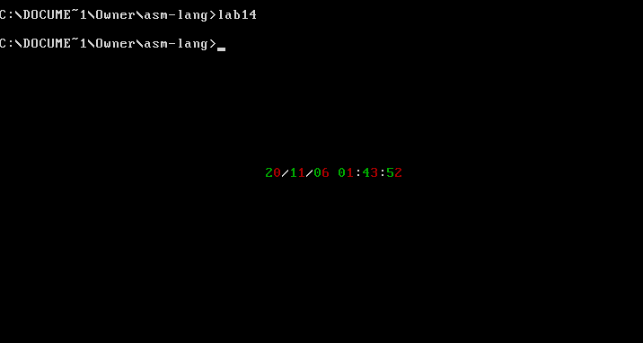

# 第 14 章：端口

## 检测点 14.1

（1）编程，读取 CMOS RAM 的 2 号单元的内容。 

```text
assume cs:code

code segment
start:
    mov al,2    ; (al)=2，2 号单元
    out 70h,al  ; 选中端口 70h 的 2 号单元
    in  al,71h  ; 从端口 71h 读出 2 号单元，送入 al

    mov ax,4c00h
    int 21h
code ends

end start
```

（2）编程，向 CMOS RAM 的 2 号单元写入 0 。

```text
assume cs:code

code segment
start:
    mov al,2    ; (al) = 2，2 号单元
    out 70h,al  ; 将 al 送入端口 70h，选中 2 号单元
    mov al,0    ; (al) = 0，写入端口
    out 71h,al  ; 将 (al)=0 写入到 71h 的 2 号单元
    mov ax,4c00h
    int 21h
code ends

end start
```

**使用 debug 测试时。我们发现 in 和 out 指令都不支持单步中断。**

## 检测点 14.2

编程，用加法和移位指令计算 \(ax\)=\(ax\)_1_0。

提示，（ax\)10=\(ax\)2+\(ax\)8 。

```text
assume cs:code
code segment
start:
    mov bx, ax
    shl ax,1    ; (ax)=(ax)*2
    mov cl,3    ; 移动次数大于 1 必须放到 cl
    shl bx,cl   ; (bx)=(ax)*8
    add ax,bx   ; (ax)=(ax)*8+(ax)*2
    mov 4c00h
    int 21h
code ends
end start
```

### 参考链接

* 汇编语言（王爽第三版）检测点14 - 筑基2017 - 博客园 
  * [https://www.cnblogs.com/Base-Of-Practice/articles/6883985.html](https://www.cnblogs.com/Base-Of-Practice/articles/6883985.html)

## 实验 14 访问 CMOS RAM

编程，以“年/月/日 时:分:秒”的格式，显示当前的日期、时间。

注意：CMOS RAM 中存储着系统的配置信息，除了保存时间信息的单元外，不要向其他的单元中写入内容，否则将引起一些系统错误。

```text
; 以“年/月/日 时:分:秒“的格式，显示当前的日期、时间。
; 秒：0 | 分：2 | 时：4 | 日：7 | 月：8 | 年：9

assume cs:code
code segment
start:
    mov ax,0b800h
    mov es,ax
    mov di, 160*12+30*2     ; es:di 指向屏幕中间
    
    mov al,9                ; 年
    call read_and_disp
    mov byte ptr es:[di+4],'/'
    
    mov al,8                ; 月
    call read_and_disp
    mov byte ptr es:[di+4],'/'

    mov al,7                ; 日
    call read_and_disp
    mov byte ptr es:[di+4],' '

    mov al,4                ; 时
    call read_and_disp
    mov byte ptr es:[di+4],':'

    mov al,2                ; 分
    call read_and_disp
    mov byte ptr es:[di+4],':'

    mov al,0                ; 秒
    call read_and_disp

    mov ax,4c00h
    int 21h

; 子程序：读取 CMOS RAM 存储的系统时间，转换成 ASCII 码，并显示
read_and_disp:
    push ax
    push cx

    add di,6    ; 递增 6 个字节，显示下一个数字
                ;   分别为：年、月、日、时、分、秒
                ; 相邻间距 3 个字：'年/月/日 时:分:秒'
                ;   字符+属性，两位数占 2 个 word，符号占 1 个 word

    ; 从 (al) 号端口读取（年/月/日/时/分/秒）信息
    out 70h,al
    in  al,71h

    ; 将字节转换成 BCD 码
    ; 两个 4 bit，分别用两个 8 位寄存器的低 4 位存储
    mov ah,al           ; ah 存储十位数
    mov cl,4
    shr ah,cl           
    and al,00001111b    ; al 存储个位数

    ; 将 BCD 码转成 ASCII 码
    add ah,30h
    add al,30h

    ; 在屏幕中间显示月份
    mov byte ptr es:[di],ah     ; 显示十位
    mov byte ptr es:[di+1],02h  ; 绿色
    mov byte ptr es:[di+2],al   ; 显示个位
    mov byte ptr es:[di+3],04h  ; 红色

    pop cx
    pop ax

    ret
code ends
end start
```



### 参考链接

* 汇编语言（王爽第三版）实验14 访问CMOS RAM - 筑基2017 - 博客园 
  * [https://www.cnblogs.com/Base-Of-Practice/articles/6883990.html](https://www.cnblogs.com/Base-Of-Practice/articles/6883990.html)

